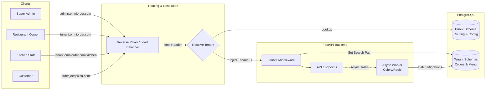

# OmniOrder

**A White-Label, Managed Micro-SaaS for Restaurant Order Management.**

## 1. Product Vision

**OmniOrder** is a production-grade, rapid-deployment order management platform designed for scale, isolation, and seamless branding.

Unlike generic platforms, OmniOrder offers a **fully white-labeled experience**. The platform administrator can "spin up" a new restaurant instance instantly. Critical to our value proposition is that we support **Custom Domains** (e.g., `order.joespizza.com`) alongside subdomains, with the frontend automatically adapting to the restaurant's brand identity (colors, fonts, logos) and hardware environment.

## 2. The OmniOrder Ecosystem (Stakeholders)

The platform is divided into four distinct interaction contexts, each catering to a specific user persona within the tenant lifecycle.

1. **The Super Admin (Platform Owner):**
    * **Goal:** Manage the SaaS business, provision new tenants, and monitor fleet health.
    * **Context:** Uses the **Global Admin Portal**. Decoupled from restaurant data.


2. **The Restaurant Owner (Tenant):**
    * **Goal:** Manage menus, prices, and business hours.
    * **Context:** Uses the **Manager Dashboard**. Data is strictly isolated to their schema.


3. **The Kitchen Staff (End User):**
    * **Goal:** View and fulfill orders in a high-stress, messy environment.
    * **Context:** Uses the **Kitchen Display System (KDS)** on tablets. Requires high reliability and offline resilience.


4. **The Hungry Customer (Public):**
    * **Goal:** Order food quickly on a mobile device.
    * **Context:** Uses the **Public Storefront**. Accessed via Custom Domains (e.g., `pizza.com`) with full brand immersion.


## 3. High-Level Architecture

The system follows a modern **Monorepo** structure containing a React frontend, a Python FastAPI backend, and a robust routing layer.

### The "Edge" Routing Layer

To support custom domains, we utilize a reverse proxy (Nginx/Caddy) strategy before hitting the application logic.

* **Scenario A (Subdomain):** Request to `burger.omniorder.com`. The app extracts `burger` and queries the tenant config.
* **Scenario B (Custom Domain):** Request to `order.joespizza.com`. The Middleware inspects the `Host` header, queries the `public.tenants` table for a `custom_domain` match, and resolves the Tenant ID.

### Core Flows

* **Dynamic Theming (Flow A):** On load, the frontend fetches a configuration object. This triggers not just CSS variable injection, but also **Dynamic Asset Loading** (fetching Google Fonts on the fly).
* **Backend Isolation (Flow B):** A middleware interceptor identifies the tenant via the resolved ID and switches the PostgreSQL `search_path` to the specific tenant schema.



---

## 4. Technology Stack

### Frontend (Client)

* **Core:** React.js 18+ with Vite.
* **Styling Engine:** **Tailwind CSS**.
* **State Management:** React Query (Server State) & Zustand (UI State).
* **Hardware Integration:** Usage of `navigator.wakeLock` API for KDS tablets.

### Backend (Server)

* **Framework:** FastAPI (Python 3.11+).
* **Database:** PostgreSQL 16+.
* **Isolation Strategy:** **Schema-per-Tenant**.
* **Async Processing:** **Redis & Celery** (Handle WebSocket broadcasts and Batch Migrations).

---

## 5. Theming & Customization Architecture

We do not build separate apps; we build one "chameleon" app that adapts its skin and assets at runtime.

### A. The Data Strategy

The styling configuration is stored in the `public` schema.

**Table: `public.tenants`**

```json
{
  "id": "uuid",
  "name": "Pasta Paradise",
  "subdomain": "pasta",
  "custom_domain": "orders.pastaparadise.com", 
  "theme_config": {
    "colors": {
      "primary": "#FF5733",
      "background": "#FFF5E1"
    },
    "typography": {
      "fontFamily": "Playfair Display", 
      "fontSource": "Google"
    },
    "layout": { "borderRadius": "0.5rem" }
  }
}

```

### B. The Injection Strategy (Frontend)

Crucially, we must load assets that don't exist in the bundle.

1. **Boot:** `App.jsx` calls `GET /api/public/config`.
2. **Asset Loader:** A `FontLoader` component parses `theme_config.typography.fontFamily`, constructs a Google Fonts URL, and dynamically appends a `<link>` tag to the document `<head>`.
3. **CSS Injection:** A `ThemeProvider` writes hex codes to `:root` CSS variables.
4. **Result:** The browser downloads the font and repaints the UI instantly to match the brand.


## 6. Database Design & Operations

We utilize **PostgreSQL Schemas** for strong isolation.

### 1. `public` Schema (Shared System Data)

* **`tenants` table:**
* `subdomain` (Index, Unique).
* `custom_domain` (Index, Unique) -> Critical for custom URL support.
* `schema_name`.
* `theme_config` (JSONB).


### 2. Tenant Schemas (e.g., `tenant_bobs_burgers`)

Replicated for each client. Contains **only** operational data (Orders, Menu, Customers).

### 3. Maintenance Strategy: Batch Migrations

Managing 1,000 schemas requires a dedicated strategy to avoid connection pool exhaustion. We do not run migrations synchronously on deployment.

* **Day 1 (Create):** `manage.py` creates a single schema immediately.
* **Day 2 (Update):** When deploying new features, a **Celery Worker** picks up the "Migration Job".
* It fetches all active schemas.
* It iterates through them in batches of 10.
* It runs `alembic upgrade head` on the batch.
* Failures are logged to a "Dead Letter Queue" for manual intervention.


## 7. Application Interfaces & Personas

Detailed breakdown of the interfaces mapped to the stakeholders defined in Section 2.

### A. The Super Admin Portal

* **URL:** `admin.omniorder.com`
* **User:** Platform Owner.
* **Key Features:**
* **Tenant Provisioning:** UI to create tenants and bind custom domains.
* **Fleet Status:** View migration status of all tenant schemas (e.g., "998/1000 Updated").


### B. The Restaurant Manager Dashboard

* **URL:** `{tenant}.omniorder.com/admin`
* **User:** Restaurant Owner.
* **Key Features:**
* **Menu Engineering:** Upload images, set categories.
* **Business Logic:** Set tax rates, open hours, and currency.
* **CMS:** Real-time price adjustments.


### C. The Kitchen Display System (KDS)

* **URL:** `{tenant}.omniorder.com/kitchen`
* **User:** Kitchen Staff / Chefs.
* **Key Features (Hardware Resilience):**
* **Hardware Wake Lock:** Utilizes `navigator.wakeLock.request('screen')` on mount to ensure the iPad/Tablet never sleeps while the app is open.
* **Offline "Heartbeat":** The app polls the server every 30 seconds. If the heartbeat fails (internet loss), the entire UI border turns flashing RED with a "CONNECTION LOST" warning to prompt staff to switch to paper.
* **Audio Context:** Uses Web Audio API for high-volume alerts on new orders.


### D. The Public Storefront

* **URL:** `{custom_domain}` or `{subdomain}.omniorder.com`
* **User:** Customer.
* **Key Features:**
* **Brand Immersion:** Total visual overhaul based on the injected theme.
* **Performance:** Heavily cached menu reads.


## 8. Developer Workflow: Adding a New Client

1. **Run Provisioning Script:**
```bash
# Usage: python manage.py create-tenant [Name] [Subdomain] --domain [CustomDomain]
python manage.py create-tenant "Sushi Zen" "sushi" --domain "order.sushizen.com"
```


2. **DNS Configuration (Manual/Automated Step):**
* The restaurant owner adds a CNAME record: `order.sushizen.com` -> `ingress.omniorder.com`.


3. **Result:**
* Visitor hits `order.sushizen.com`.
* Nginx routes to Backend.
* Middleware sees Host header, finds `tenant_sushi` schema.
* Frontend loads, sees "Sushi" config, injects Red colors and Japanese-style fonts.