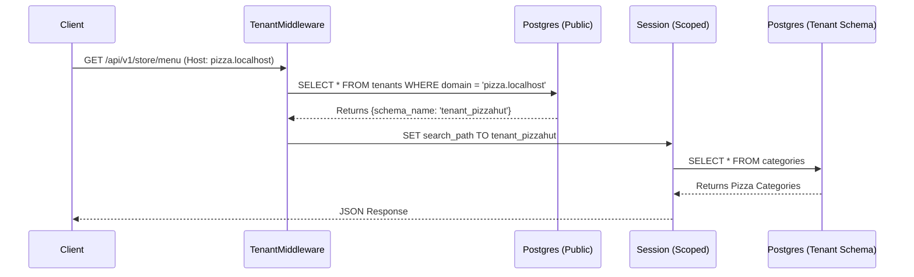
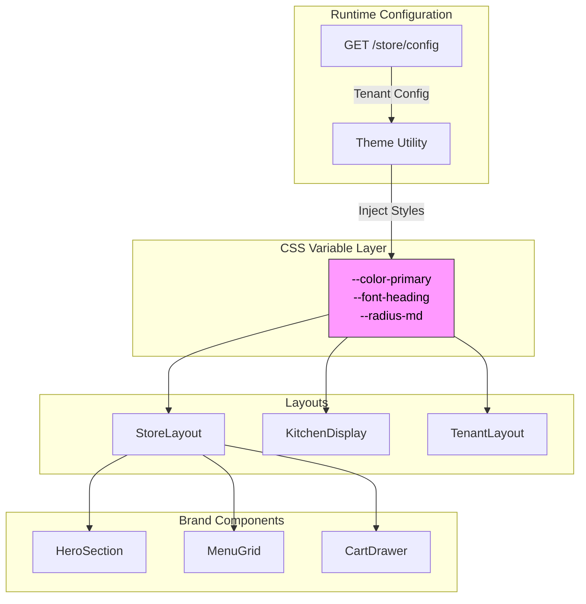

# OmniOrder Architecture

**OmniOrder** is a white-label, multi-tenant SaaS platform designed for high-scale restaurant order management. It employs a **"Schema-per-Tenant"** database strategy for strict data isolation and a **"Chameleon" frontend architecture** that dynamically adapts branding (colors, fonts, layouts) based on the accessing domain.

## 1. High-Level Infrastructure

The platform runs as a containerized micro-service stack orchestrated via Docker Compose.

* **Edge Layer (Nginx):** Acts as the ingress controller. It reverse-proxies requests based on paths (`/api` vs `/`) while preserving the `Host` header, which is critical for tenant resolution.
* **Application Layer:**
    * **API (FastAPI):** Stateless REST and WebSocket server.
    * **Web (React/Vite):** Single Page Application served dynamically.
* **Data Layer (PostgreSQL):** A single database instance segmented logically by PostgreSQL Schemas.


```mermaid
graph TD
    Client[Browser / Client]
    subgraph "Docker Host"
        Nginx[Nginx Reverse Proxy]
        
        subgraph "Application Layer"
            Web[React / Vite Container]
            API[FastAPI Container]
        end
        
        subgraph "Data Layer"
            DB[(PostgreSQL 15)]
        end
    end

    Client -->|[http://pizza.localhost](http://pizza.localhost)| Nginx
    Client -->|[http://burger.localhost](http://burger.localhost)| Nginx
    
    Nginx -->|/api/*| API
    Nginx -->|/*| Web
    
    API -->|SQLAlchemy + Alembic| DB
    
    note[Host Header Preserved for Tenant Resolution]
    style note fill:#f9f,stroke:#333,stroke-width:2px,color:black
    Client -.-> note


```

---

## 2. Backend Architecture: The Isolation Engine

The backend is built on **FastAPI** and **SQLAlchemy**, utilizing a middleware-driven approach to handle multi-tenancy transparently.

### Key Components

1. **Tenant Resolution Middleware:**
* Intercepts every request.
* Extracts the `Host` header (e.g., `pizza.localhost`).
* Resolves the specific Tenant ID and Schema Name from the `public.tenants` table.
* **Context Switching:** Executes `SET search_path TO {tenant_schema}, public` on the database session. This ensures that a query for `SELECT * FROM orders` automatically hits `tenant_pizzahut.orders` without changing application code.

2. **Provisioning System (`/sys/provision`):**
* Transactional workflow that:
1. Creates a record in the `public` schema.
2. Executes raw SQL to create a new Postgres Schema.
3. Iterates through SQLAlchemy models to build tables dynamically within that new schema.
4. Seeds initial data (Admin user, Default Menu).

3. **Real-Time KDS (WebSockets):**
* The `ConnectionManager` groups WebSocket connections by `schema_name`.
* When an order is placed via REST, the event is broadcast only to the specific tenant's WebSocket channel, ensuring data privacy.




---

## 3. Frontend Architecture: The Chameleon UI

The frontend is a **React 19** Monorepo application using **Tailwind CSS v4**. It is designed to look completely different depending on the active tenant configuration.

### Theming Strategy (Semantic Abstraction)

Instead of hardcoding colors, the application uses CSS Variables (Tokens) that are injected at runtime.

1. **Boot Phase:** On load, `StoreLayout` fetches configuration via `useTenantConfig`.
2. **Asset Injection:**
* **Fonts:** The `FontLoader` component dynamically fetches and injects Google Fonts based on the config.
* **Colors/Radius:** The `applyTheme` utility maps the configuration (or a Preset like "Mono Luxe" or "Fresh Market") to CSS variables (`--color-primary`, `--radius-lg`) applied to the root element.


3. **Component Adaptation:**
* Components like `BrandButton` and `HeroSection` rely entirely on these tokens.
* Layouts (Centered vs. Split vs. Banner) are toggled via the `preset` configuration.


### Contextual Routing

The router handles four distinct application contexts within one codebase:

1. **Storefront:** Public facing, brand-heavy, optimized for conversion (`StoreLayout`).
2. **KDS:** High contrast, dark mode, audio-enabled, auto-refreshing (`KitchenDisplay`).
3. **Tenant Admin:** Standard SaaS dashboard for menu/staff management (`TenantLayout`).
4. **Platform Admin:** Super-admin view for provisioning and infrastructure health (`PlatformLayout`).



---

## 4. Data Model Strategy

The database uses a hybrid shared/isolated approach:

* **Public Schema (`public`):**
* **Tenants Table:** Stores routing rules (`domain`), system IDs (`schema_name`), and visual config (`theme_config` JSON).


* **Tenant Schemas (`tenant_*`):**
* Identical structure replicated for every customer.
* **Users:** Authentication and Role-Based Access Control.
* **Menu Hierarchy:** `Categories` -> `MenuItems` -> `ModifierGroups` -> `ModifierOptions`.
* **Orders:** Transactional data containing JSON snapshots of ordered items.

This structure allows the platform to scale to thousands of tenants without massive `WHERE tenant_id = X` clauses, while simplifying data compliance (GDPR/CCPA) by keeping tenant data physically separated in schemas.
