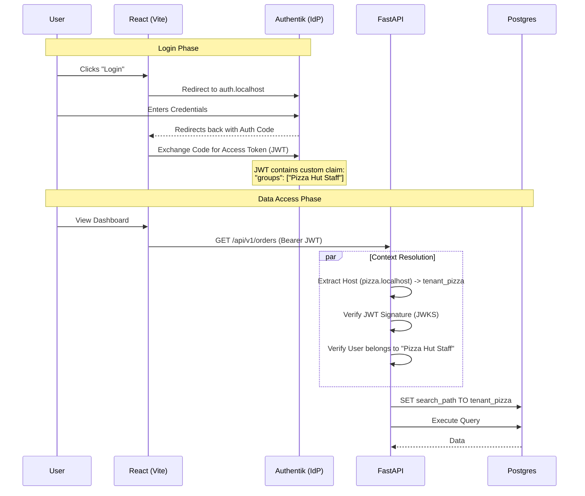

# Authentication & Identity Architecture

## 1. Executive Summary

Stelly uses **OpenID Connect (OIDC)** via **Authentik** for all identity management. 

Instead of managing passwords locally, we federate identity. The backend (FastAPI) is stateless, verifying JWT signatures via JWKS. The frontend (React) uses the Authorization Code flow with PKCE.

Crucially, **Multi-Tenancy** is enforced via **Group Membership claims** injected into the JWT.

---

## 2. Architecture Diagram

