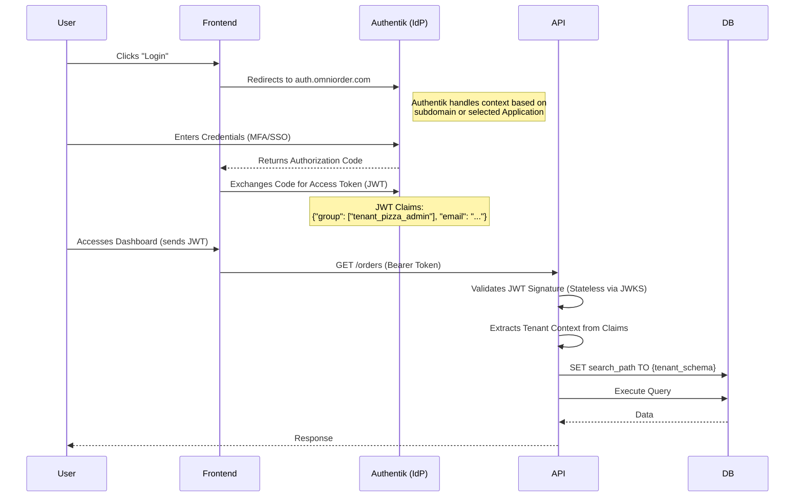

# Authentication & Identity Strategy

## 1. Executive Summary

Authentication in a multi-tenant SaaS application is significantly more complex than in single-tenant apps. Users must not only be authenticated ("Who are you?") but strictly authorized within a specific context ("Which tenant data can you access?").

Currently, OmniOrder uses a **Custom Local Authentication (MVP)** implementation where user credentials live inside tenant-specific database schemas.

**Strategic Direction:** To ensure security, reduce maintenance liability, and enable features like SSO/MFA, we will transition to an **Identity Provider (IdP)** model using **OpenID Connect (OIDC)**.

---

## 2. Phase 1: Current Architecture (The MVP)

**Status:** *Active / Implemented*

The current implementation is a "Siloed Auth" pattern. There is no central users table. A user exists *only* within the specific Postgres schema of the restaurant they work for.

### 2.1 The Data Model
* **Location:** `tenant_{name}.users` table.
* **Storage:** Passwords are hashed using `bcrypt` (via `passlib`).
* **Isolation:** A user with email `admin@gmail.com` can exist in `tenant_pizza` and `tenant_burger` with different passwords. They are treated as two completely separate entities.

### 2.2 The Login Flow
1. **Client:** Sends POST to `/api/v1/auth/login` with `username`, `password`, and the `Host` header.
2. **Middleware:** Intercepts request, reads `Host`, resolves `schema_name`, and sets the DB search path.
3. **Verification:** The API queries `SELECT * FROM users` *inside* that schema and verifies the hash.
4. **Issuance:** The server signs a **JWT** using a shared `KZ_SECRET_KEY`.

---

## 3. Phase 2: Target Architecture (OIDC Integration)

**Status:** *Recommended Upgrade*

We will offload identity to **Authentik**. It aligns perfectly with our architecture because, like OmniOrder, Authentik natively supports multi-tenancy and can isolate data logically or physically.

### 3.1 Why Authentik?

| Feature | Authentik | Keycloak | Clerk |
| :--- | :--- | :--- | :--- |
| **Architecture** | **Python/Django** (Lightweight) | Java/JVM (Heavy) | SaaS (Closed Source) |
| **Multi-Tenancy** | **Native** (Schema isolation supported) | Realms (Logical isolation) | Organizations |
| **Cost** | Free / Open Source | Free / Open Source | Paid Scale |
| **Developer Exp** | Modern UI, easy Docker setup | Complex XML/UI | Excellent SDKs |

**Recommendation:** Use **Authentik** for self-hosted/local capability, maintaining complete data sovereignty.

### 3.2 The New Flow (Standard OIDC)

We stop managing passwords entirely. The API becomes stateless regarding user credentials.



### 3.3 Changes Required to Migrate

1. **Infrastructure (`docker-compose.yml`):**
* Add Authentik Server and Worker containers.
* Add a Redis container (already present for API, can be shared or separate).


2. **API Dependencies (`deps.py`):**
* Replace local DB lookup with `python-jose` or `pyjwt` validation against Authentik's public key (JWKS).
* **Crucial:** The `get_current_user` dependency must extract the tenant identifier from the JWT `groups` or custom claims to set the Postgres `search_path`.


3. **Provisioning (`sys.py`):**
* Update `POST /provision`. In addition to creating the Postgres schema, it must now call the Authentik API to:
* Create a **Group** (e.g., `tenant_pizzahut_admins`).
* Create a **Scope Mapping** ensuring users in this group get the `schema_name` claim in their token.


### 4. Implementation Example (Authentik)

**1. Docker Compose Additions:**

```yaml
  server:
    image: ghcr.io/goauthentik/server:2023.10.0
    command: server
    environment:
      AUTHENTIK_REDIS__HOST: redis
      AUTHENTIK_POSTGRESQL__HOST: db
      AUTHENTIK_POSTGRESQL__NAME: authentik
      # ... other config ...
    depends_on:
      - db
      - redis

  worker:
    image: ghcr.io/goauthentik/server:2023.10.0
    command: worker
    environment:
      AUTHENTIK_REDIS__HOST: redis
      AUTHENTIK_POSTGRESQL__HOST: db
      AUTHENTIK_POSTGRESQL__NAME: authentik
    depends_on:
      - db
      - redis

```

**2. Token Validation Logic (Python):**

```python
from fastapi import Depends, HTTPException
from fastapi.security import OAuth2PasswordBearer
import jwt # PyJWT

oauth2_scheme = OAuth2PasswordBearer(tokenUrl="http://localhost:9000/application/o/token/")

def get_current_user(token: str = Depends(oauth2_scheme)):
    # 1. Fetch JWKS from Authentik (Cache this!)
    jwks_client = jwt.PyJWKClient("http://authentik:9000/application/o/omniorder/jwks/")
    signing_key = jwks_client.get_signing_key_from_jwt(token)
    
    try:
        data = jwt.decode(
            token,
            signing_key.key,
            algorithms=["RS256"],
            audience="omniorder-api"
        )
    except jwt.exceptions.InvalidTokenError:
        raise HTTPException(status_code=401, detail="Invalid token")

    # 2. Extract Tenant Context
    # We assume Authentik maps the user's group to a claim "tenant_schema"
    tenant_schema = data.get("tenant_schema") 
    
    if not tenant_schema:
        raise HTTPException(status_code=403, detail="No tenant context found")

    return UserContext(id=data["sub"], schema=tenant_schema)
```

# Authentik Configuration Guide

This guide details the manual steps required to configure **Authentik** as the Identity Provider (IdP) for the OmniOrder platform.

Since we are running self-hosted Authentik via Docker, these steps must be performed in the Authentik Admin Interface after the stack is booted for the first time.

---

## 1. Initial Initialization

1. **Boot the Stack:** Ensure `docker-compose up` is running.
2. **Access the Setup Flow:** Navigate to [http://auth.localhost/if/flow/initial-setup/](http://auth.localhost/if/flow/initial-setup/).
3. **Set Admin Password:** Define the password for the default `akadmin` user.
   * *Note: Keep this safe. This is the "God Mode" account for your Identity Infrastructure.*

---

## 2. Create the Provider

The Provider defines *how* authentication happens (protocol) and *where* tokens are sent.

1. Log in to the **Admin Interface** (click "Admin Interface" in the top right if you land on the User Dashboard).
2. Go to **Applications** -> **Providers** in the sidebar.
3. Click **Create**.
4. Select **OAuth2/OpenID Provider** and click **Next**.
5. Fill in the form:
   * **Name:** `OmniOrder Provider`
   * **Authentication Flow:** `default-authentication-flow` (or explicitly select one).
   * **Authorization Flow:** `default-provider-authorization-explicit-consent` (this shows the "Allow Access" screen) or `default-provider-authorization-implicit-consent` (skips the prompt, smoother for users).
   * **Client Type:** `Public` (since we are using a SPA/React frontend).
   * **Client ID:** `omniorder-web`
   * **Redirect URIs:**
     ```text
     http://.*\.localhost/.*
     ```
     * *Critial Note:* Because OmniOrder uses dynamic subdomains (`pizza.localhost`, `burger.localhost`), we cannot list every single URL. We use a **Regular Expression** to allow any subdomain.
6. Click **Finish**.

---

## 3. Create the Application

The Application acts as the container for the Provider and defines access policies.

1. Go to **Applications** -> **Applications** in the sidebar.
2. Click **Create**.
3. Fill in the form:
   * **Name:** `OmniOrder`
   * **Slug:** `omniorder`
   * **Provider:** Select `OmniOrder Provider` (created in step 2).
4. Click **Create**.

---

## 4. Verification

To ensure the setup is correct, we need to verify the **OpenID Configuration URL** and **JWKS (JSON Web Key Set)** endpoint. The Backend API uses these to validate tokens without needing a shared secret.

1. Go back to **Applications** -> **Providers**.
2. Click on `OmniOrder Provider`.
3. Look for the **Provider Metadata** section.
4. Verify the **JWKS URL**. It should look like:
   `http://auth.localhost/application/o/omniorder/jwks/`

*Note for Developers:* Inside the Docker network (Back-channel communication), the API will access this via the internal container name: `http://authentik-server:9000/application/o/omniorder/jwks/`.

---

## 5. (Advanced) Scope Mapping for Tenants

*Phase 2 Requirement.*

To pass the "Tenant Schema" (e.g., `tenant_pizzahut`) inside the JWT, we will need a Custom Scope.

1. Go to **Customization** -> **Property Mappings**.
2. Create **Scope Mapping**.
3. **Name:** `tenant-scope`
4. **Scope Name:** `tenant`
5. **Expression:**

   ```python
   # Logic to determine tenant based on user groups or attributes
   # For MVP, we might return a list of accessible schemas
   return {
       "tenant_schema": request.user.attributes.get("tenant_schema", "public")
   }
  ```

6. Go back to the **Provider**, edit it, and add `tenant-scope` to the **Selected Scopes** list.