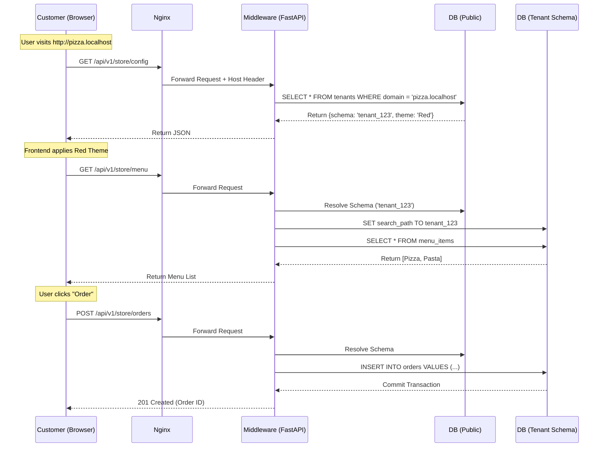

# MVP Technical Design: The "Order Lifecycle" Vertical Slice

**Target:** Critical Path Validation (Provisioning  Menu  Customer Order)
**Scope:** Strict Vertical Slice

## 1. Executive Summary

The MVP focuses on validating the **Polyglot Monorepo's** core value proposition: **Schema-per-Tenant isolation** delivered via a **White-Label Frontend**.

We will strip away auxiliary features (User Auth, Payment Gateways, KDS interfaces, complex Admin UI) to focus purely on the flow of data from a specific Tenant Schema to a branded Customer Interface.

### The Vertical Slice Definition

1. **System:** Provisioning a new Tenant Schema (API-driven).
2. **Manager:** Adding a single Menu Item (Basic CRUD).
3. **Customer:** Resolving the Tenant via Domain  Loading Theme  Viewing Menu  Placing an Order.

---

## 2. MVP Architecture & Constraints

To ensure speed of delivery, this MVP introduces specific constraints to the broader architecture defined in `tdd.md`.

### A. Architectural Scope

| Component | MVP State | Notes |
| --- | --- | --- |
| **Edge (Nginx)** | **Full Fidelity** | Must handle `Host` header forwarding perfectly to test domain resolution. |
| **Frontend (React)** | **Storefront Only** | No Admin Dashboard UI. We will use Swagger/Postman for admin tasks. |
| **Backend (FastAPI)** | **Core + Store Endpoints** | Includes Middleware for schema switching. Auth is bypassed (Guest Checkout). |
| **Database (Postgres)** | **Multi-Schema** | Public schema + dynamic creation of tenant schemas. |
| **Worker (Celery)** | **Mocked / Sync** | Migrations will run synchronously for the MVP to reduce complexity. |

### B. The "Chameleon" Theme Engine (MVP)

We will implement a simplified version of the theming engine. Instead of full font loading logic, we will demonstrate distinct branding via CSS Variables.

* **Input:** Tenant config `{ "primary_color": "#ff0000", "font": "sans-serif" }`.
* **Output:** ``.

---

## 3. Data Model & Schema Design

We need two distinct schema definitions to prove isolation.

### A. `public` Schema (Routing & Config)

* **`tenants`**
* `id` (UUID, PK)
* `schema_name` (String, Unique)  *Driver for routing*
* `domain` (String, Unique)  *e.g., "pizza.localhost"*
* `theme` (JSONB)  *Stores branding config*

### B. `tenant_{id}` Schema (Operational Data)

Every tenant will have identical tables, created dynamically.

* **`menu_items`**
* `id` (UUID, PK)
* `name` (String)
* `price` (Integer)  *Stored in cents*
* `is_available` (Boolean)

* **`orders`**
* `id` (UUID, PK)
* `customer_name` (String)
* `status` (Enum: PENDING, CONFIRMED)
* `total_amount` (Integer)
* `items` (JSONB)  *Snapshot of items ordered*

---

## 4. API Interface Specification

The MVP will rely on these four endpoints to prove the vertical slice works.

### 1. Provisioning (Internal/Dev Tool)

* **Endpoint:** `POST /api/v1/sys/provision`
* **Purpose:** Bootstraps the test environment.
* **Logic:**
1. Insert into `public.tenants`.
2. Execute `CREATE SCHEMA tenant_x`.
3. Run `alembic upgrade head` on `tenant_x`.

### 2. Menu Management (Manager Context)

* **Endpoint:** `POST /api/v1/manager/menu`
* **Header:** `X-Tenant-ID: {uuid}` (For MVP simplicity, bypass domain resolution for management).
* **Body:** `{ "name": "Margherita Pizza", "price": 1200 }`
* **Logic:** Middleware switches to `tenant_x` schema  Insert `menu_items`.

### 3. Storefront Config (Customer Context)

* **Endpoint:** `GET /api/v1/store/config`
* **Header:** `Host: pizza.localhost`
* **Logic:**
1. Middleware reads `Host`.
2. Look up `public.tenants`.
3. Return `{ "theme": {...}, "tenant_id": "..." }`.

### 4. Order Placement (Customer Context)

* **Endpoint:** `POST /api/v1/store/orders`
* **Header:** `Host: pizza.localhost`
* **Body:** `{ "items": [{"id": "...", "qty": 1}], "customer": "John Doe" }`
* **Logic:**
1. Middleware resolves Host  Schema.
2. Verify Items exist in `tenant_x.menu_items`.
3. Insert into `tenant_x.orders`.

---

## 5. Sequence Diagram: The Critical Path

This flow demonstrates the successful interaction of all layers.

---

## 6. Implementation Plan & Milestones

### Phase 1: The Infrastructure Skeleton (Days 1-2)

* **Goal:** `docker-compose up` works.
* **Task:** Setup Postgres container.
* **Task:** Setup FastAPI with basic `SQLAlchemy` engine.
* **Task:** Implement the `TenantMiddleware` that intercepts requests and prints the resolved schema to stdout.

### Phase 2: The Data Layer (Day 3)

* **Goal:** Ability to create a schema and write to it.
* **Task:** Define Alembic env.py to support multi-tenant migrations.
* **Task:** Create the `provision` endpoint.

### Phase 3: The Frontend Connection (Days 4-5)

* **Goal:** A React page that changes color based on the URL.
* **Task:** Update `/etc/hosts` locally to map `pizza.localhost` and `burger.localhost` to `127.0.0.1`.
* **Task:** Implement `useTenantConfig` hook in React.
* **Task:** Build a simple "Menu Grid" component using Tailwind.

### Phase 4: Integration (Day 6)

* **Goal:** End-to-end flow.
* **Task:** Verify that an Order placed on `pizza.localhost` does **not** appear in the `burger.localhost` database tables. **(Crucial Validation Step)**.

---

## 7. Validation Strategy

To declare the MVP successful, we must pass the "Leakage Test":

1. Provision **Tenant A** (Domain: `a.com`) and **Tenant B** (Domain: `b.com`).
2. Add "Burger" to Tenant A.
3. Add "Salad" to Tenant B.
4. Query Tenant A's menu via API. **Success condition:** Only "Burger" is returned.
5. Place order on Tenant A.
6. Inspect Tenant B's `orders` table. **Success condition:** Table is empty.