# Production architecture

## Cloud architecture

This diagram outlines a scalable, multi-tenant architecture for Stelly on Azure, separating concerns into distinct layers for optimal performance and security.

* **Global Edge (Azure Front Door):** The single entry point handling all traffic (`*.stelly.com`). It provides security (WAF), SSL termination, and intelligent routing:
    * Static assets (`/`)  **Azure Static Web Apps** (Frontend).
    * Authentication (`/auth`)  **Authentik** (Identity Provider).
    * REST API requests (`/api`)  **HTTP Service**.
    * Real-time connections (`/ws`)  **WebSocket Service**.

* **Compute Layer (Azure Container Apps):** Hosting is split to allow independent scaling:
    * **HTTP Service:** Handles standard transactions (orders, menu updates). Scales aggressively on request volume (KEDA). Crucially, it **publishes events** (like "New Order") to Redis rather than sending them directly to clients.
    * **WebSocket Service:** Manages persistent connections for Kitchen Displays. Scales based on active connection count. It **subscribes to Redis** to receive events and push them to the correct kitchen screens.
    * **Worker:** Handles background tasks and database migrations asynchronously.

* **Data Layer:**
    * **Azure Postgres Flex:** Stores all business data using a **Schema-per-Tenant** model for strict data isolation.
    * **Azure Redis Cache:** The bridge between services. It enables the decoupled HTTP and WebSocket services to communicate instantly via Pub/Sub.
    * **Azure Blob Storage:** efficient storage for menu images.

This design ensures that a spike in customer orders (HTTP traffic) automatically scales the API without destabilizing the long-lived connections required for the kitchen displays.

```mermaid
graph TD
    %% --- ACTORS ---
    Customer([📱 Customer Device])
    Kitchen([🖥️ Kitchen Display])
    Admin([💻 Manager Dashboard])

    %% --- EDGE LAYER ---
    subgraph Edge ["Global Edge & Routing"]
        DNS[Azure DNS Zone<br/>*.stelly.com]
        AFD[Azure Front Door Premium<br/>WAF + SSL Offload]
    end

    %% --- FRONTEND LAYER ---
    subgraph Frontend ["Static Content"]
        SWA[Azure Static Web Apps<br/>React / Vite]
    end

    %% --- COMPUTE LAYER ---
    subgraph Compute ["Azure Container Apps Environment - VNet Isolated"]
        direction TB
        
        %% Identity Service
        Auth[Authentik Identity Provider<br/>SSO / OIDC]

        %% Service 1: HTTP API (REST)
        subgraph HTTP_Service ["HTTP Service - Transactional"]
            API_HTTP[stelly-api-http]
            Scaler_HTTP[KEDA: Scale on Req/Sec]
        end

        %% Service 2: WebSocket API (Real-time)
        subgraph WS_Service ["WebSocket Service - Persistent"]
            API_WS[stelly-api-ws]
            Scaler_WS[KEDA: Scale on Active Conn]
        end

        %% Service 3: Workers
        Worker[Celery Worker<br/>Async Tasks / Migrations]
    end

    %% --- DATA LAYER ---
    subgraph Data ["Persistence Layer"]
        PG[(Azure Postgres Flex<br/>Schema-per-Tenant)]
        Redis[(Azure Redis Cache<br/>Pub/Sub + Rate Limit)]
        Blob[Azure Blob Storage<br/>Menu Images]
    end

    %% --- FLOWS ---

    %% 1. DNS & Entry
    Customer -->|https| AFD
    Kitchen -->|https/wss| AFD
    Admin -->|https| AFD
    DNS -.->|CNAME| AFD

    %% 2. Routing Logic
    AFD -->|Path: / - Assets| SWA
    AFD -->|Path: /auth/*| Auth
    AFD -->|Path: /api/* - REST| API_HTTP
    AFD -->|Path: /ws/* - WebSockets| API_WS

    %% 3. Authentication Flow
    SWA -.->|OIDC Redirect| Auth
    API_HTTP -.->|Validate JWT| Auth

    %% 4. Data Interactions (HTTP)
    API_HTTP -->|Read/Write Order| PG
    API_HTTP -->|Get Images| Blob
    API_HTTP -->|1. Publish OrderCreated| Redis

    %% 5. The Real-Time Bridge
    Redis -.->|2. Push Event| API_WS
    API_WS -->|3. Broadcast Update| Kitchen

    %% 6. Worker & Async
    Worker -->|Run Migrations| PG
    API_HTTP -.->|Trigger Task| Worker

    %% --- STYLING ---
    classDef azure fill:#0078D4,stroke:#fff,stroke-width:2px,color:#fff;
    classDef logic fill:#5C2D91,stroke:#fff,stroke-width:2px,color:#fff;
    classDef data fill:#107C10,stroke:#fff,stroke-width:2px,color:#fff;
    classDef actor fill:#333,stroke:#fff,stroke-width:2px,color:#fff;

    class AFD,SWA,API_HTTP,API_WS,Worker,Auth azure;
    class Scaler_HTTP,Scaler_WS logic;
    class PG,Redis,Blob data;
    class Customer,Kitchen,Admin,DNS actor;
```



## Theming and design engine

The **Theming and Design Engine** is the visual "skin" of the multi-tenant architecture. In production on Azure, it needs to be data-driven, highly cacheable, and strictly isolated from business logic.

Here is the architectural design for the **Theming Engine** mapped to the Cloud Architecture.

---

### 1. The Core Concept: "Headless" Theming

The Frontend (Azure Static Web Apps) must become "dumb." It should not know what "Mono Luxe" or "Fresh Market" means. It should simply receive a set of CSS tokens (colors, radii, fonts, assets) from the API and apply them.

### 2. Architecture Map

Here is how the Theming Engine flows through the Azure components:

#### A. Data Layer (Azure Postgres Flex)

We maintain the **Public Schema** strategy for routing and branding. We do **not** put theme config inside the isolated tenant schemas (`tenant_pizza`), because branding is needed *before* authentication or complex transaction logic occurs.

**Schema Refinement (`public.tenants`):**
Instead of a simple JSON blob, we structure the `theme_config` to be the "source of truth" for the frontend CSS variables.

```sql
-- Conceptual Schema in Azure Postgres (Public Schema)
CREATE TABLE public.tenants (
    id UUID PRIMARY KEY,
    domain VARCHAR(255) UNIQUE NOT NULL, -- Used for routing (Azure Front Door -> API)
    
    -- The "Design Token" Payload
    theme_config JSONB DEFAULT '{
        "colors": {
            "primary": "#2563EB",
            "secondary": "#1E293B",
            "background": "#FFFFFF",
            "surface": "#F8FAFC"
        },
        "typography": {
            "headingFontUrl": "https://assets.stelly.com/fonts/inter-bold.woff2", 
            "bodyFontUrl": "https://assets.stelly.com/fonts/inter-reg.woff2"
        },
        "shape": {
            "radiusMd": "8px"
        },
        "assets": {
            "logoUrl": "https://stellyblob.blob.core.windows.net/tenants/123/logo.png",
            "heroUrl": "https://stellyblob.blob.core.windows.net/tenants/123/hero.webp"
        }
    }'
);

```

#### B. Caching Layer (Azure Redis Cache)

Theming is **Read-Heavy**. Every single customer landing on `pizza.com` requests this configuration. Hitting Postgres for every page load will kill performance.

1. **The Flow:** `GET /api/v1/store/config`
2. **API Logic:** Check Redis key `config:{domain}`.
3. **Hit:** Return JSON immediately (< 5ms).
4. **Miss:** Query Postgres `public.tenants`, store in Redis with a TTL (e.g., 1 hour), return JSON.
5. **Invalidation:** When the Admin updates settings (`PUT /settings`), the API writes to Postgres and immediately `DEL config:{domain}` in Redis.

#### C. Content Delivery (Azure Front Door & Blob Storage)

Your current code uses Unsplash links or hardcoded assets. In production:

1. **Storage:** Use **Azure Blob Storage** for user uploads (logos, hero images).
2. **Organization:** Structure blobs by tenant ID: `container-assets/{tenant_id}/logo.png`.
3. **Delivery:** Do not serve directly from Blob Storage. Route it through **Azure Front Door** to cache images at the Edge.
4. **Optimization:** Implement an Azure Function trigger on image upload to generate WebP versions and resize them automatically.

#### D. The Frontend (React / Azure SWA)

Refactor `apps/web/src/layouts/StoreLayout.tsx` and `utils/theme.ts`.

Instead of looking up a preset name, the frontend will map the API response directly to CSS Variables on the `:root` element.

**New Logic:**

```typescript
// utils/theme.ts (Production Concept)
export const applyDynamicTheme = (config: RemoteThemeConfig) => {
    const root = document.documentElement;
    
    // 1. Apply Colors directly from DB
    root.style.setProperty('--color-primary', config.colors.primary);
    root.style.setProperty('--color-bg-app', config.colors.background);
    
    // 2. Load Fonts dynamically (GDPR compliant - self hosted on Azure Blob)
    loadFontFaces(config.typography); 
};

```

---

### 3. Summary of Changes Required

| Feature | Current Demo Implementation | Production Architecture (Azure) |
| --- | --- | --- |
| **Logic** | Hardcoded logic in React (`THEME_PRESETS`) | "Headless" - Config purely driven by JSON from API. |
| **Database** | `theme_config` stores just a preset name. | `theme_config` stores raw design tokens (colors, urls). |
| **Performance** | Direct DB query on every page load. | **Redis Cache** (API Layer) + **Azure Front Door** (Edge Cache). |
| **Images** | Hardcoded URLs / MinIO (local). | **Azure Blob Storage** + Image Processing Pipeline. |
| **Fonts** | Google Fonts (GDPR Risk). | Self-hosted font files served via Azure CDN. |
