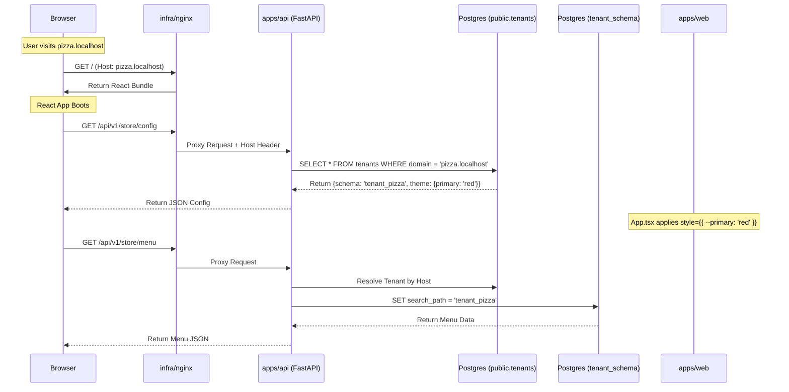

# Technical Design Document: OmniOrder Monorepo Architecture

**Scope:** File Structure, Component Responsibilities, and Code Organization Strategy.

## 1. Architectural Strategy

OmniOrder utilizes a **Polyglot Monorepo** architecture. This places the frontend (JavaScript/React), backend (Python/FastAPI), and infrastructure (Docker/Nginx) into a single repository to ensure atomic commits and unified versioning.

The architecture is driven by the **Schema-per-Tenant** isolation model, which heavily influences the backend directory structure and the database migration strategy.

## 2. Directory Structure (MVP Status)

The repository is organized into three primary high-level directories: `apps` (Application Logic), `infra` (DevOps & Database), and `scripts` (Validation).

```text
omniorder-monorepo/
├── docker-compose.yml           # Orchestration for local development
├── README.md                    # Project documentation
│
├── apps/                        # Deployable Application Services
│   ├── web/                     # Frontend: React + Vite
│   │   ├── public/              
│   │   ├── src/
│   │   │   ├── components/      # UI Components
│   │   │   │   └── MenuGrid.tsx # Storefront Menu Logic
│   │   │   ├── hooks/           # Custom Hooks
│   │   │   │   └── useTenantConfig.ts # Fetches theme/config based on Host
│   │   │   ├── App.tsx          # Main Entry point & Dynamic Theme Injection
│   │   │   ├── main.tsx         # React DOM hydration
│   │   │   └── index.css        # Tailwind directives & CSS Variables
│   │   ├── tailwind.config.js   # Tailwind config (mapped to CSS vars)
│   │   └── vite.config.ts       # Vite build & Proxy config
│   │
│   └── api/                     # Backend: Python + FastAPI
│       ├── app/
│       │   ├── api/             # API Route Definitions
│       │   │   └── v1/          # Versioning
│       │   │       ├── store.py # Public Storefront endpoints
│       │   │       └── sys.py   # System Provisioning endpoints
│       │   ├── core/            # Core application config
│       │   │   ├── config.py    # Environment variables (Pydantic Settings)
│       │   │   └── middleware.py # Tenant ID & Schema switching logic
│       │   ├── db/              # Database Logic
│       │   │   ├── base.py      # SQLAlchemy Base
│       │   │   ├── session.py   # DB Connection Factory
│       │   │   └── models.py    # SQLAlchemy Models (Public & Tenant)
│       │   ├── schemas/         # Pydantic Schemas
│       │   │   └── provision.py # Input/Output models for provisioning
│       │   ├── main.py          # App entry point
│       │   └── worker.py        # Celery App entry point (Placeholder)
│       ├── alembic/             # Database Migrations
│       │   ├── env.py           # Multi-tenant migration logic
│       ├── alembic.ini          # Alembic config
│       ├── Dockerfile           # Python runtime image
│       └── requirements.txt     # Python dependencies
│
├── infra/                       # Infrastructure as Code
│   ├── nginx/                   # Edge Router
│   │   └── nginx.conf           # Reverse Proxy Configuration
│   └── postgres/                # DB Initialization scripts
│       └── init.sql             # Public schema bootstrapping
│
└── scripts/
    └── validate_mvp.py          # End-to-end isolation validation script

```

## 3. Component Deep Dive

### A. The Edge Layer (`infra/nginx`)

This acts as the gatekeeper and the first point of contact for all requests.

* **Reverse Proxy:** Routes traffic based on paths (`/api` goes to backend, `/` goes to frontend).
* **Header Forwarding:** Crucially, it forwards the original `Host` header to the backend so the application can distinguish between `pizza.localhost` and `burger.localhost`.

### B. The Frontend Application (`apps/web`)

The frontend is a simplified "Chameleon" SPA for the MVP.

* **`src/App.tsx` (Theme Engine):**
* **Responsibility:** Reads the config fetched from the API hook.
* **Action:** Injects CSS variables (e.g., `--primary`) into the root `div` style property. Tailwind is configured to consume these variables.


* **`src/hooks/useTenantConfig.ts`:**
* **Responsibility:** Identifies the current host (window.location) and queries the backend for the specific tenant configuration.


* **`src/components/MenuGrid.tsx`:**
* **Responsibility:** Fetches menu items and allows "Quick Buy" orders. It is unaware of *which* tenant it is serving; it simply hits the API, which handles the context.


### C. The Backend Application (`apps/api`)

The backend is built on FastAPI and handles the multi-tenancy logic.

* **`app/core/middleware.py` (TenantMiddleware):**
* **Phase 1 (MVP):** Intercepts requests and logs the `Host` header for verification.
* **Phase 2 (Logic):** In the endpoint logic (e.g., `store.py`), the specific tenant is resolved, and the `search_path` is set via raw SQL (`SET search_path TO ...`) before queries are executed.


* **`app/api/v1/sys.py` (Provisioning):**
* **Responsibility:** Handles the creation of new tenants.
* **Action:** Writes to `public.tenants`, creates a new PostgreSQL schema using raw SQL, and dynamically creates tables within that schema using SQLAlchemy metadata.


* **`app/api/v1/store.py` (Storefront):**
* **Responsibility:** Public-facing endpoints for Menu and Orders.
* **Isolation:** Uses the helper `get_tenant_by_host` to resolve context and switch database paths dynamically.


### D. The Database Layer (`apps/api/alembic`)

We use SQLAlchemy and Alembic, customized for multi-tenancy.

* **`alembic/env.py`:**
* **Standard Mode:** Runs migrations on the `public` schema.
* **Tenant Mode:** Contains a loop that fetches all schemas from `public.tenants` and runs the migration script against each one sequentially.
* **Filtering:** Uses `include_object` hooks to ensure shared tables stay in `public` and tenant tables stay in `tenant_x`.


## 4. Request Lifecycle Diagram

To illustrate how these directory components interact during a live request in the MVP:



## 5. Development Workflow

1. **Unified Startup:** A single `docker-compose up` command brings up the Postgres DB, the API (with hot-reload), and the Frontend (with HMR).
2. **Validation:** The `scripts/validate_mvp.py` script mimics the "Super Admin" and "Customer" roles to verify that data written to one domain does not leak into another.
3. **Cross-Origin Handling:** The `vite.config.ts` uses a proxy to forward `/api` requests to the backend container, eliminating CORS issues during local development.