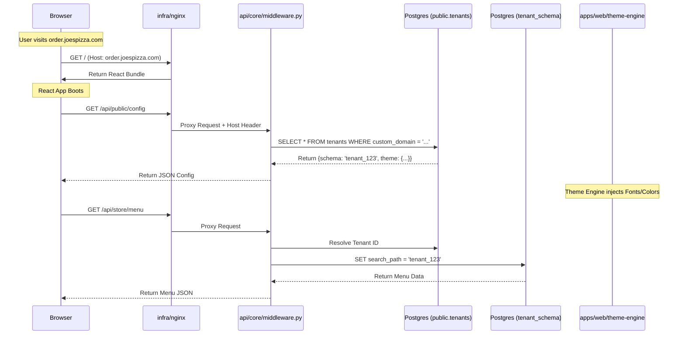

# Technical Design Document: OmniOrder Monorepo Architecture

**Scope:** File Structure, Component Responsibilities, and Code Organization Strategy.

## 1. Architectural Strategy

OmniOrder utilizes a **Polyglot Monorepo** architecture. This places the frontend (JavaScript/React), backend (Python/FastAPI), and infrastructure (Docker/Nginx) into a single repository to ensure atomic commits, simplified dependency management, and unified versioning.

The architecture is driven by the **Schema-per-Tenant** isolation model, which heavily influences the backend directory structure and the database migration strategy.

## 2. Directory Structure

The repository is organized into three primary high-level directories: `apps` (Application Logic), `libs` (Shared Logic), and `infra` (DevOps & Database).

```text
omniorder-monorepo/
├── .github/                     # CI/CD workflows (Test, Lint, Build)
├── docker-compose.yml           # Orchestration for local development
├── Makefile                     # Shortcuts (e.g., `make up`, `make migrate`)
├── README.md                    # Project documentation
│
├── apps/                        # Deployable Application Services
│   ├── web/                     # Frontend: React + Vite
│   │   ├── public/              # Static assets (Favicons, manifest)
│   │   ├── src/
│   │   │   ├── assets/          # Base SVGs/Images
│   │   │   ├── components/      # Shared UI Components (Buttons, Inputs)
│   │   │   ├── features/        # Feature-based architecture
│   │   │   │   ├── admin/       # Super Admin Portal Views
│   │   │   │   ├── manager/     # Restaurant Manager Views
│   │   │   │   ├── kds/         # Kitchen Display System logic (WakeLock)
│   │   │   │   └── storefront/  # Public Customer Views
│   │   │   ├── hooks/           # Custom Hooks (useTenantConfig, useCart)
│   │   │   ├── lib/             # Utilities (FontLoader, Axios instance)
│   │   │   ├── store/           # Zustand Stores (UI State)
│   │   │   ├── App.tsx          # Main Entry point
│   │   │   └── main.tsx         # React DOM hydration
│   │   ├── tailwind.config.js   # Base Tailwind config
│   │   └── vite.config.ts       # Vite build config
│   │
│   └── api/                     # Backend: Python + FastAPI
│       ├── app/
│       │   ├── api/             # API Route Definitions
│       │   │   ├── v1/          # Versioning
│       │   │   │   ├── admin/   # Super Admin endpoints
│       │   │   │   ├── public/  # Storefront endpoints (High cache)
│       │   │   │   └── tenant/  # Manager/KDS endpoints
│       │   ├── core/            # Core application config
│       │   │   ├── config.py    # Environment variables (Pydantic Settings)
│       │   │   ├── security.py  # JWT & Auth logic
│       │   │   └── middleware.py # Tenant ID & Schema switching logic
│       │   ├── db/              # Database Logic
│       │   │   ├── base.py      # SQLAlchemy Base
│       │   │   ├── session.py   # DB Connection Factory
│       │   │   └── models/      # SQLAlchemy Models
│       │   ├── services/        # Business Logic (Stripe, Email, etc.)
│       │   └── worker.py        # Celery App entry point
│       ├── alembic/             # Database Migrations
│       │   ├── versions/        # Migration scripts
│       │   └── env.py           # Logic to iterate over schemas
│       ├── alembic.ini          # Alembic config
│       ├── Dockerfile           # Python runtime image
│       └── requirements.txt     # Python dependencies
│
└── infra/                       # Infrastructure as Code
    ├── nginx/                   # Edge Router
    │   ├── nginx.conf           # Main config
    │   └── templates/           # Configs for SSL/Proxying
    └── postgres/                # DB Initialization scripts

```

## 3. Component Deep Dive

### A. The Edge Layer (`infra/nginx`)

This acts as the gatekeeper and the first point of contact for all requests.

* **Reverse Proxy:** Routes traffic based on paths (e.g., `/api` goes to backend, `/` goes to frontend).
* **Header Forwarding:** Crucially, it must forward the original `Host` header to the backend so the application can distinguish between `order.joespizza.com` and `burger.omniorder.com`.

### B. The Frontend Application (`apps/web`)

The frontend is a single "Chameleon" SPA. It does not contain hardcoded branding.

* **`src/lib/theme-engine.ts` (Concept):**
* **Responsibility:** Reads the config fetched from the API.
* **Action:** Injects CSS variables (colors) into `:root` and dynamically constructs Google Font URLs to append to the `<head>`.


* **`src/features/kds`:**
* **Responsibility:** Kitchen operations.
* **Specific Logic:** Contains the `navigator.wakeLock` implementation and the "Heartbeat" poller that triggers the Red Border UI alert on connection loss.


* **`src/features/storefront`:**
* **Responsibility:** The customer facing view.
* **Specific Logic:** Highly optimized for mobile. Relies on the "Custom Domain" context to load specific menus.


### C. The Backend Application (`apps/api`)

The backend is built on FastAPI and handles the multi-tenancy logic.

* **`app/core/middleware.py` (TenantMiddleware):**
* **Input:** Receives the `Host` header from the request.
* **Lookup:** Queries `public.tenants` to find the associated `schema_name`.
* **Action:** executes `SET search_path TO tenant_schema, public;` on the database session for the duration of that request.


* **`app/worker.py` (Celery):**
* **Responsibility:** Asynchronous background tasks.
* **Key Task:** **Batch Migrations**. When the code creates a new table structure, this worker iterates through all 1,000+ tenant schemas to apply the `alembic upgrade` command, preventing a "thundering herd" on the DB during deployment.


### D. The Database Layer (`apps/api/alembic`)

We use SQLAlchemy and Alembic, but customized for multi-tenancy.

* **`alembic/env.py`:**
* **Standard Mode:** Runs migrations on the `public` schema (for system config tables).
* **Tenant Mode:** Contains a loop that fetches all schemas from `public.tenants` and runs the migration script against each one sequentially.


## 4. Request Lifecycle Diagram

To illustrate how these directory components interact during a live request (e.g., a customer visiting a custom domain), refer to the following flow:



## 5. Development Workflow (Monorepo Benefits)

1. **Unified Startup:** A single `docker-compose up` command brings up the Postgres DB, Redis, the API (with hot-reload), the Frontend (with HMR), and the Celery worker.
2. **Shared Types (Future Proofing):** While currently separate languages, JSON contracts (OpenAPI) generated by FastAPI in `apps/api` can be used to generate TypeScript interfaces in `apps/web` automatically using tools like `openapi-typescript-codegen`, ensuring the frontend never breaks due to backend API changes.
3. **Atomic Deployments:** A change to the database schema (Backend) and the corresponding UI field (Frontend) are committed in the same Git PR, simplifying rollback strategies.